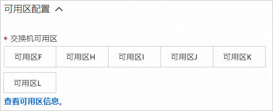
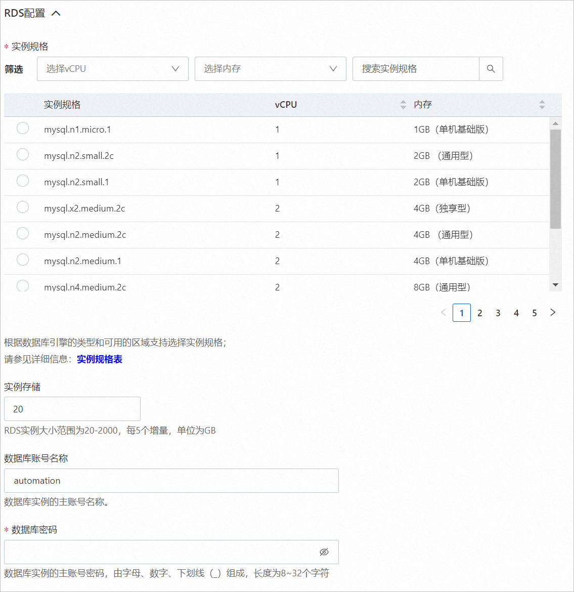

Bio-Research服务实例部署文档 
=========================================

概述 
-----------------------

Bio-Research系统不同于传统生物药MES系统，它充分考虑了生物药生产过程的特性，将生产、实验和质控等数据统一在一个平台上，保证了系统合规和数据记录的完整性和一致性，减少了计算机系统验证的难度，提升了企业的管理精度、生产效率、质量水平。本文向您介绍如何部署Bio-Research服务实例。

RAM用户所需权限 
------------------------------

Bio-Research服务需要对ECS、VPC、OSS等资源进行访问和创建操作，若您使用RAM用户创建服务实例，需要在创建服务实例前，对使用的RAM用户的账号添加相应资源的权限。添加RAM权限的详细操作，请参见[为RAM用户授权](https://help.aliyun.com/document_detail/116146.html)。

需要添加的权限如下表所示。

|       权限策略名称        |        备注         |
|---------------------|-------------------|
| AliyunECSFullAccess | 管理云服务器服务（ECS）的权限。 |
| AliyunVPCFullAccess | 管理专有网络（VPC）的权限。   |
| AliyunOSSFullAccess | 管理对象存储服务（OSS）权限。  |

Bio-Research服务资源配置 
---------------------------------------

默认配置

* 1台2 vCPU 8 GiB的实例。

* 系统盘空间40 GiB。

推荐配置

* 1台4 vCPU 16 GiB的实例。

* 系统盘类型为cloud_essd。

* 系统盘空间60 GiB。

限制条件

系统盘空间不少于40 GiB。

部署流程 
-------------------------

部署步骤

1. 单击[部署链接](https://computenest.console.aliyun.com/user/cn-hangzhou/serviceInstanceCreate?ServiceId=service-ab53822bbbff4388a41d&ServiceVersion=1)，在部署界面填写相应的参数，完成部署。

2. 部署完成后，登录[ECS控制台](https://ecs.console.aliyun.com/)，通过服务实例部署的公网IP访问应用。

部署参数说明

您可以通过服务商在计算巢中发布的服务，一键部署阿里云资源和服务商提供的软件。在创建服务实例的过程中，需要配置服务实例信息，下文介绍Bio-Research服务实例需要配置的详细参数。

* **地域**

  请结合实际情况选择合适的地域。当前仅华北2（北京）可选。
  

* **可用区配置**

  选择新建ECS实例的可用区。
  

* **选择已有基础资源配置**
  * 专有网络VPC实例ID：根据实际情况，选择合适的现有虚拟专有网络的实例ID。
  
  * 交换机实例ID：根据实际情况，选择合适的现有业务网络交换机的实例ID。
  

  

* **ECS实例配置**

  根据配置界面提示，选择合适的参数。ECS实例推荐选择2 vCPU 8 GiB及以上的实例类型。
  

* **RDS配置**

  根据配置界面提示，选择合适的参数。RDS实例推荐选择2 vCPU 8 GiB及以上的实例类型。
  

* **付费类型配置**

  选择ECS实例的付费类型。可选值：
  * 按量付费
  
  * 包年包月
  

  

  

